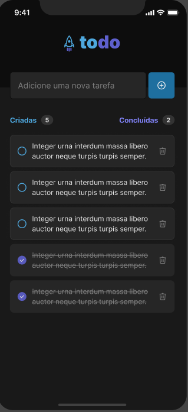

## Descrição

#### Projeto desenvolvido como desafio durante o curso de react-native da rocketseat. O app permite adicionar uma tarefa podendo marcar como feita e remove-la da lista de tarefas.

```
npm install
npm start
```
